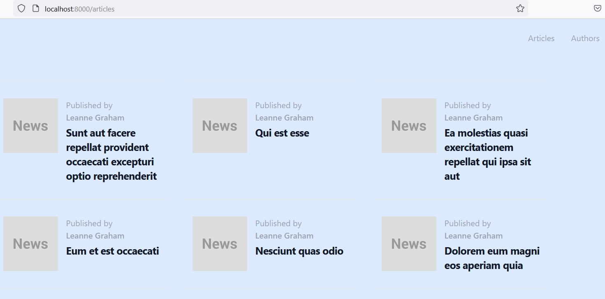
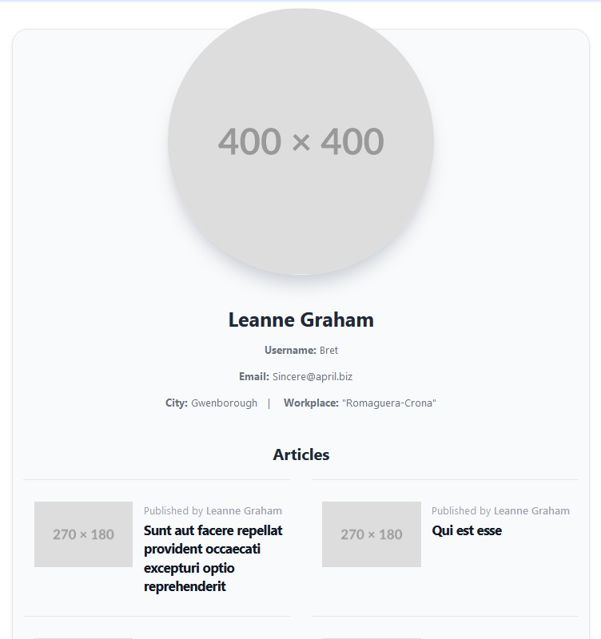

## Table of contents
* [General info](#general-info)
* [Technologies](#technologies)
* [Setup](#setup)
* [Preview](#priview)

## General info
This project is simple news website with articles, comments and authors. I am using information from https://jsonplaceholder.typicode.com/ and pictures from https://placehold.co/.

## Technologies
This project is created using php 7.4 language.

## Setup

1. Copy files from repository to you IDE.
2. Run ```composer install```
3. Run the command php -S localhost:8000 -t public
4. Open your web browser and enter localhost:8000/articles
5. Have fun!


## Preview




